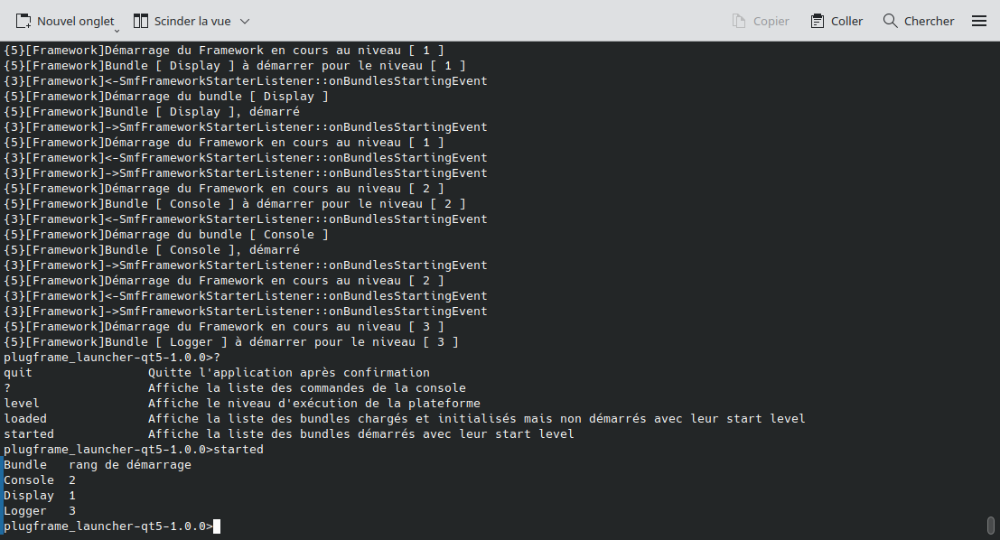
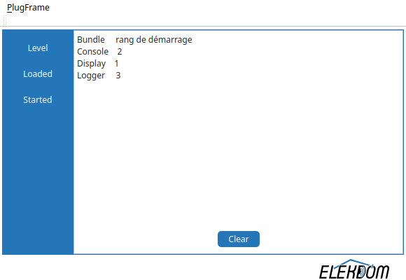

# PlugFrame

**PlugFrame** is a modular and dynamic component-based framework for C++/Qt applications. It provides a lightweight service-oriented architecture to facilitate the development of maintainable, extensible, and decoupled systems — ideal for applications requiring runtime modularity, such as supervision and control systems.

This repository contains the core framework developed by [ELEKDOM](https://elekdom.fr), and is intended as a technical foundation for multiple software projects, including the **OpLink** prototype.

---

## Features

- **Bundle architecture** based on QtPlugin (dynamic libraries)
- **Service-oriented communication** between bundles (with service registration & lookup)
- **Qt 5.15 integration**, including CLI and GUI-based bundle interaction
- Core components: lifecycle manager, logging system, headless or GUI-based shells
- Designed with clean separation between plugin loading and logic implementation

---

## Repository Structure

```bash
ELEKDOM-PlugFrame/
│
├── plugframe/           # Main framework modules (core-lib, framework, logger, etc.)
│   ├── core-lib/        # Base types and interfaces for all bundles
│   ├── framework/       # The runtime core and bundle manager
│   ├── logger/          # Logging mechanism based on Qt
│   ├── console/         # Text-based interactive shell
│   ├── display/         # Console output renderer
│   ├── guidisplay/      # GUI version of the display component
│   ├── guiconsole/      # GUI shell for command execution
│   └── users/           # Optional bundle for authentication logic
│
├── applications/        # Placeholder directory for applications using PlugFrame
│   └── oplink/          # [NOT included in this repository] See the OpLink repo
│
└── PlugFrame.pro        # Qt project file for IDE setup
```

---

## Requirements

- **Qt 5.15** (with qmake)
- C++11 compatible compiler (tested with `g++` on **Ubuntu 24.04**)
- Recommended: [QtCreator](https://www.qt.io/product/development-tools) for development

---

## Build Instructions (with Shadow Build)

### Recommended: QtCreator

PlugFrame is designed to be developed using **QtCreator**, leveraging its **shadow build** feature to cleanly separate build artifacts from source code.

**Steps:**

1. Open `PlugFrame.pro` in **QtCreator**
2. In the menu: *Projects → Build & Run → Build Settings*
3. Enable **"Shadow build"**
4. Choose a build directory outside the source tree (e.g., `../build-PlugFrame`)
5. Add a **"Custom Step"**
6. Select the script `install_oplink.py`
7. Check the `PYTHONPATH` value
8. Click **Build**

> This is the recommended method for all development work.

---

### Optional: Command-line Build (for compilation only)

You may also compile PlugFrame from the terminal using `qmake`:

```bash
# Clone the repository
git clone https://github.com/elekdom/ELEKDOM-PlugFrame.git
cd ELEKDOM-PlugFrame

# Create and move to a build directory (shadow build style)
mkdir ../build-PlugFrame
cd ../build-PlugFrame

# Run qmake and make
qmake ../ELEKDOM-PlugFrame/PlugFrame.pro
make -j$(nproc)
```

> This approach is suitable for compiling the project, but **not recommended for active development**.

---

## Preview

 The PlugFrame's Console Overview

 The PlugFrame's GuiConsole Overview

---

## License

This project is licensed under the **GNU General Public License v3.0 (GPL-3.0)**.  
See the [LICENSE](./LICENSE) file for more details.

All source files include appropriate GPLv3 headers.

---

## Roadmap

> Work in progress — this repository currently serves as a **technical demonstrator**.

### Next milestones:

- Qt6 integration
- Windows and MacOs compilation
- Raspy cross compiation 
- Unit tests and CI integration
- GitHub wiki with technical documentation
- First packaged release (v0.1.0)
- Managing bundle dependencies (RESOLVED state)
- Dynamic service binding (currently static)
- ***and more according to future needs expressed***

---

## Contributions & Services

PlugFrame is actively maintained by **ELEKDOM**.  
If you're interested in:

- Using PlugFrame in your project
- Custom adaptations or training
- Commercial partnerships or technical contributions

**Contact us via LinkedIn or https://elekdom.fr or contact@elekdom.fr**.

---
